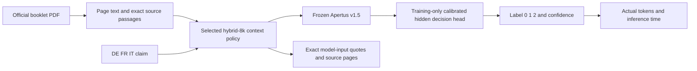

# Phase 2 — grounding controls and efficiency study

Status: phase2 completed; frozen final choice **hybrid-8k**, validation Macro-F1 **0.949069**. See context-results.json, final-results.json and the completed technical report. No LoRA and no new consumed310 access. Earlier sections below record the chronological preliminary audit.

## Claim artifact probes

Train-only grouped C selection and OOF temperature calibration; vocabulary fitted inside each fold. Validation only. These CPU lexical probes are NOT the Apertus claim-only control.

| Probe | Validation Macro-F1 |
|---|---:|
| claim-word-tfidf | 0.620765 |
| claim-char-tfidf | 0.626285 |
| metadata | 0.507226 |

## Cached frozen-head context interventions

The unchanged full-context trained head is applied to previously recorded actual Apertus encodings. Zero new GPU calls, no refitting. These are sensitivity/evidence diagnostics, not a selected architecture or a context-matched training sweep. Timings are cached GPU encoding plus previously measured retrieval, excluding new CPU head overhead; not fresh end-to-end serving.

| Context | Validation Macro-F1 | Mean input tokens | Cached seconds | E/C decision preservation |
|---|---:|---:|---:|---:|
| full | 0.894461 | 14106.1 | 3.635 | 1.000 |
| bm25 | 0.661108 | 1654.6 | 0.401 | 0.454 |
| dense | 0.848070 | 1395.8 | 0.359 | 0.749 |
| hybrid | 0.861704 | 1656.6 | 0.426 | 0.781 |
| reference | 0.940951 | 2269.7 | 0.540 | 0.820 |

Oracle/reference context is diagnostic only and cannot be required in production. Decision preservation is not proof of evidence sufficiency: the full head is being applied under a context distribution shift. Five-passage hybrid looks promising, but grounding controls must pass before optimizing it.

## Dataset structure and scope risks

Validation: 276 rows, 207 unique normalized claim/document pairs, three voting events, two duplicate-connected components. Deterministic deduplicated Macro-F1: 0.883035, versus row-level 0.894461. Exploratory event-resampling 95% percentiles: [0.863617, 0.944241]; three events do not support a reliable population interval and two are duplicate-connected.

`premise-scope-risk.json` records manually inspected example ost-v1.1-0732: stored Neutral label and COVID reference, while full booklet pages 6/32 discuss climate neutrality2050 and Federal Council arguments for accelerating fossil-fuel transition. This is a possible reference-vs-booklet scope mismatch, not proof that every neutral label is wrong. Original labels remain unchanged. `final-error-analysis.jsonl` inventories all29 validation errors; five have source-inspected qualified hypotheses (scope, numeric equivalence, truncation/current-vs-proposed rules); others remain undetermined rather than receiving invented causal explanations.

## Evidence and confidence

`evidence-diagnostics.json` reports reference5gram overlap, not organizer scoring. Mean coverage: full .586, BM25 .147, dense .201, hybrid .217. Neutral references can be deliberately unrelated to claims: low overlap there is not necessarily retrieval failure. Cached hybrid E/C decision preservation .781 is a limited diagnostic, not minimal proof validation.

Original full head validation: ECE .082754 (10 bins), Brier .173079, NLL .321408. Confidence reliability is recorded in CPU audit: the .50–.70 bucket has accuracy .617; .95–1 bucket is90/90 correct on this small validation. Adaptive routing has NOT been selected or tuned yet.

## Next gate and budget

1. Actual Apertus claim-only train902/validation276 encodings and train-only head.
2. Same original full head on wrong same-language different-event documents, seeds42/1337, plus empty/generic context.
3. If scores retain>=90% of correct-context F1 or lie within .05, investigate artifacts and stop architecture optimization. Wrong-document original-label scoring measures artifact retention, not actual NLI correctness for swapped booklets.
4. Only then context/retrieval matched-head efficiency experiments, evidence, final architecture.

Vast observed balance at phase2 start: USD6.534131. New discretionary cap USD4.50; preserve USD2.00. Local audit snapshot predates GPU launch; current lease/cost status is authoritative in `../budget.json`. Quoted known RTX A6000 48GB /60GB disk: USD0.416667/h, expected1.5h (~USD0.63), conservative3h plus30GB download/recovery margin <=USD1.351. Recheck offer and account credit immediately before leasing; host quotes are not reservations.

`connected-component-resampling.json` also resamples the two duplicate-connected validation units (199/77 rows), with descriptive95% percentiles [.863617, .903166]. This is not an independent-test confidence interval. `claim-artifact-catalog.json` confirms697 unique normalized train claim/document pairs and zero exact normalized claim overlap with validation. `wrong-document-overlap-diagnostic.json` measures~.021 reference5gram coverage for both wrong-document permutations, versus~.586 for correct capped context; overlap is not swapped-pair NLI ground truth.

Frontend verification:38 application tests passed both host and minimal Docker; two separate NumPy research tests passed on host. Live Docker parsed a SHA-verified official72-page French booklet into157 passages and selected52 exact page/offset source quotes. The endpoint is unconfigured for classification on this cloud host; actual native GPU controls run on the disposable Vast lease. No live classification is claimed for the frontend.

Error comparison: the restricted base class scorer is correct on20 of29 cases that the learned full head gets wrong. Both manually inspected75%/three-quarters cases have correct base full-context Entailment but incorrect learned-head decisions. This locates a decision-mapping failure in those cases; it does not establish that Apertus weights need fine-tuning or explain why the mapping fails.

## Actual Apertus grounding controls

Registered gate: **GO_WITH_LIMITATIONS**. No warning conditions. All2006 actual native GPU forwards completed; original model weights/head unchanged, no LoRA, no consumed310 access.

| Condition | Original-label validation Macro-F1 |
|---|---:|
| correct_document_frozen_head | 0.894461 |
| claim_only_train_fitted_head | 0.699640 |
| claim-only | 0.210229 |
| wrong-42 | 0.565341 |
| wrong-1337 | 0.553328 |
| generic | 0.174688 |

Wrong-document scores retain only 63.2%/61.9% of correct-context score. These substantial drops support context dependence under the registered controls. They do not prove correct evidence reasoning: original labels are not true labels for intervened premises. Refitted claim-only capability .700 shows residual claim artifacts; empty-context original head .210 measures a different intervention. Only two wrong permutations and few events were tested.

Source encodings and fitted claim-only audit: `../apertus-v15-phase2-controls-v1`; recovered archive SHA `d023629cf7e283a66b13b05c1f92b4c05165fc50544a7eac47aa049abe437c0b`. All105 export-part SHA checks, complete archive checksum and experiment file checks passed. Task-owned instance54722568 destroyed and verified absent via paginated provider API. New context study is preregistered in `context-protocol.json`; no efficiency architecture is selected yet.

## Additional claim similarity audit

Fixed1-nearest-neighbor E5 claim-only classifier: validation Macro-F1 .583725;64 of276 nearest-training claim cosines exceed .95,12 exceed .98. Three manually inspected high-similarity pairs are near paraphrases of Assembly recommend/reject/accept statements across different voting events. Exact normalized overlap being zero therefore does not establish semantic independence. High cosine alone is not duplicate-task or leakage proof: a numerical or negation change can reverse NLI, and different booklets are genuinely different premises. These development probes are not deployed.

The registered final check includes an original full-head A6000 recheck to resolve the historical A40-versus-A6000 numerical confound. A compact candidate must additionally pass condition-matched wrong-booklet controls and three actual cross-language PDF CLI calls before deployment changes.

## Phase 2 — completed falsification and efficiency study

All Apertus weights remain frozen. No LoRA, QLoRA,70B or model-weight fine-tuning. The consumed310 predictions were not reopened, re-inferred, recalibrated or used for selection. The new architecture comparisons use902 training/276 validation examples only. Training-only connected-group OOF selects head regularization and temperature. Architecture selection is validation development, not new independent held-out proof.

### Actual grounding controls

| Condition | Original-label validation Macro-F1 |
|---|---:|
| Correct capped/full original head | 0.894461 |
| Claim-only separately training-fitted head | 0.699640 |
| Empty premise, frozen original head | 0.210229 |
| Wrong-event same-language booklet, seed42 | 0.565341 |
| Wrong-event same-language booklet, seed1337 | 0.553328 |
| Generic premise, frozen original head | 0.174688 |

The preregistered gate passes with limitations: substantial context-intervention drops support document dependence. Claim-only .700 and lexical/metadata controls expose residual claim-label signal. Wrong/empty scores use original labels as retention targets; these are NOT true NLI labels for intervened premises. Generic/empty predict Neutral almost exclusively; low original-label scores alone do not prove semantic grounding. Two permutations and few independent events limit conclusions.

### Context-matched comparisons

| Context | Matched hidden-head F1 | Native restricted base-score F1 | Mean prompt tokens | Cached seconds | Cross-language F1 | Reference5gram coverage |
|---|---:|---:|---:|---:|---:|---:|
| hybrid-1k | 0.844729 | 0.499006 | 892.8 | 0.523 | 0.795535 | 0.141 |
| hybrid-2k | 0.887575 | 0.526673 | 1941.0 | 0.777 | 0.842796 | 0.239 |
| hybrid-4k | 0.886942 | 0.573981 | 4017.4 | 1.365 | 0.853584 | 0.352 |
| hybrid-8k | 0.949069 | 0.548775 | 8059.6 | 2.520 | 0.941796 | 0.495 |
| prefix-2k | 0.766764 | 0.347449 | 1920.9 | 0.453 | 0.785921 | 0.122 |
| Fresh original full A6000 recheck | 0.894461 | 0.671612 | 14106.1 | 3.316 | 0.873829 | historical0.586 |

Hybrid depth5/10/20/30 and total prompt caps1024/2048/4096/8192 are jointly varied, not a factorial causal experiment. Prefix2048 is document-order control. Whole source passages are packed with the official tokenizer including system/claim/assistant prefix. No reference enters inference. Matched-head seconds sum separately measured encoding, retrieval and CPU decision overhead; they are not full HTTP/PDF request latency. The fresh full recheck measures actual integrated prediction on the same GPU family. Initialization and PDF parsing are separate.

Historical unchanged-full-head context diagnostics: full .894461/14106tokens/3.635s; BM25 .661108/1655/.401; dense .848070/1396/.359; hybrid .861704/1657/.426; oracle/reference .940951/2270/.540. The oracle is a perfect-reference evidence diagnostic for the original frozen full head, unavailable in production; it is not a universal mathematical ceiling for different matched heads. Applying a full-trained head to retrieval features diagnoses distribution shift and is distinct from matched-head training.

### Frozen decision and live verification

Final choice: **hybrid-8k**, validation Macro-F1 **0.949069**, cross-language **0.941796**, deduplicated207-pair Macro-F1 **0.945610**. Originally registered efficiency choice: hybrid-4k; final verification candidate: hybrid-8k; final guard failures: []. Choose smallest mean token count only among candidates within .02 overall/.03 cross-language/.05 each-class F1 of original full; also check against fresh full replication. This original efficiency decision is immutable. A separately registered exploratory8k accuracy extension can supersede deployment only with >=.04 overall and>=.03 cross-language F1 gains, no class regression, <=75% original full tokens, no worse Brier/NLL, matched grounding guards and actual CLI/frontend replication. Both use the same development validation; neither establishes independent hidden-test superiority.

| Final provisional-head intervention | Original-label F1 | Retention |
|---|---:|---:|
| wrong-42 | 0.468262 | 0.493 |
| wrong-1337 | 0.453133 | 0.477 |
| empty | 0.273247 | 0.288 |

Original-full A6000 recheck changed 0 of276 labels from historical A40; maximum probability difference 0. Same weights, head and input contract. This explicitly checks the hardware/numerical confound in initial grounding comparisons.

Three actual native GPU PDF CLI calls cover DEclaim/FRdocument, FRclaim/ITdocument and ITclaim/DEdocument. An additional actual frontend PDF-upload/prediction request uses the same frozen head. Source PDF hashes, labels, exact quotes/pages, token counts and measured request times are archived. Browser visual rendering is a separate check; API inference is real. See final-results.json, accuracy-results.json if available, and their source experiments. The accuracy extension reuses the verified276 full recheck and180 unchanged4k neighbor/diversity forwards; it does not repeat them.

### Evidence, errors, calibration and uncertainty

Every packed source quote/page/offset/hash is checked against the canonical PDF extraction. Evidence output is explicitly model-input source context, not validated minimal proof or attribution. Reference5gram overlap is an approximate development diagnostic, not organizer scoring. Neutral references may be intentionally unrelated; their absence is not an evidence-retrieval failure. Booklet-wide Neutral remains difficult to establish with retrieved context. The possible reference-vs-booklet scope conflict ost-v1.1-0732 remains documented without relabeling. The deterministic nine-case source inspection is reported separately in evidence-audit.json; it is qualitative, not blinded official evidence scoring.

Final calibration: ten-bin ECE **0.028410**, Brier **0.070524**, NLL **0.139329**. Confidence buckets, class/language/pair/event metrics and all remaining validation errors with qualified source hypotheses are in final-results.json. No validation temperature fitting. Cached routing simulations at fixed confidence thresholds .50/.70/.85/.95 count both forwards when escalating; no threshold/router is adopted.

Original full head fixes82 base mistakes but introduces20 errors where the restricted base score was correct; both err on9. Both source-inspected75%/three-quarters cases already have correct base decisions with identical input. This is decision-mapping evidence, not proof that Apertus weights cannot handle numeric equivalence or that LoRA would help.

Validation has276 rows but207 unique claim/document pairs, three voting events and two duplicate-connected units199/77; train also has only two connected units838/64. Exact normalized train/validation claim overlap is zero, but E5 claim1-nearest-neighbor scores .584 and high-cosine near-paraphrases occur across events. Descriptive event/component resampling is not a defensible independent-document population confidence interval. Language slices and validation model selection are not organizer-hidden generalization claims. Historical310 F1 .899920 belongs only to the original full head; any newly selected compact head has no fresh held-out score.

### Costs, reproducibility and remaining work

Phase2 observed incremental provider spend **USD1.5128**, remaining credit **USD5.0213** at 2026-10-08T02:14:17.173797+00:00. Task-owned active leases: **0**. Authorized cap USD4.50; required reserve USD2. Provider accounting can post delayed charges. Full lease/deletion/pagination verification is in experiments/budget.json; bound estimates are not final invoices.

Clean-checkout make run builds the hash-locked Docker PDF/HTTP application. Configure the documented pinned native head backend via LLM_NAME/LLM_BASE_URL/LLM_API_KEY (or explicit FROZEN_BASE_URL). A generic base chat endpoint does not reproduce a learned hidden head. The native backend uses the pinned PyTorch image, CUDA12.8/hash-locked requirements, official Apertus fork and original six SHA-verified model shards; supporting E5 is required only for hybrid context. Cache downloads outside Git; cached inference requires no model-download token. Original head, source predictions, model/dataset/PDF manifests, input contracts, registered protocols, actual feature archives and source-file SHA checks preserve auditability.

No scientific evidence here justifies spending the remaining credit on LoRA now. Priorities are new independent booklet evaluation, semantic evidence sufficiency and resolving premise-scope ambiguity with organizers. Exact future evaluator adapters can be added without changing document/claim inference. No invented hardware/Internet/CLI restrictions and no Devpost dependency. Submission to the organizer website is a separate action.

### Frozen architecture

### Bounded neighboring/diversity ablations and evidence-only forwards

Both ablations use the same deterministic90 validation rows (first10 per gold-class/claim-language stratum), frozen hybrid4k matched head and4096 total-token cap. No new head training and no small-sample architecture adoption.

| Same90 cases | Macro-F1 | Mean tokens | Seconds | Neutral precision | Neutral recall |
|---|---:|---:|---:|---:|---:|
| Direct top20 | 0.878545 | 4010.0 | 1.712 | 0.964 | 0.900 |
| Top6 seeds with source neighbors | 0.912086 | 3866.2 | 0.995 | 1.000 | 0.900 |
| Duplicate-suppressed top30→20 | 0.889580 | 4022.5 | 1.087 | 0.964 | 0.900 |

Neighbor/diversity request adds shared measured retrieval/preparation plus actual encoding/head; baseline is cached. Not paired live all-inference latency.
Diversity suppresses same-page50% overlap or word5gram Jaccard>=.55. Neighbor expansion takes seed/previous/next source passages. Both preserve exact numbers/text; neither adds a summarizing LLM. Redundancy counts and source IDs are archived. Any gain on90 cases is a follow-up hypothesis, not a new deployment choice.

Proposed semantic/hybrid-ranked **one/two-passage evidence**: **12 actual native evidence-only forwards**, decision preservation **0.750**. Strictly reduced contexts: **12**, preservation **0.750**. Cases are first2 distinct normalized claim/document pairs predicted Entailment/Contradiction per claim language; no confidence cherry-picking. The same frozen candidate head receives only those proposed source quotes. Strictly reduced cases are reported separately; unchanged one-passage contexts do not establish evidence sufficiency. Preserved decisions do not prove relevance or sufficiency, and changed predictions do not automatically invalidate evidence. No minimal-proof claim or automatic evidence-based router is adopted. Exact quote/page proofs and actual feature SHA checks are retained.

### Additional fixed-grid4k to8k adaptive simulation

Threshold0.95 escalates **22.8%** of276 rows and simulates Macro-F1 **0.945312**, **5853** tokens and **1.949s**, counting both forwards. This is a promising lower-token point, not a failed or dominated idea. Its E/C reference-nearest quote presence is **66.3%**, versus78.1% for fixed8k. Fixed8k is retained for higher static F1/source coverage, one head/one forward and verified live integration; no independently verified router is claimed. Threshold transfer and actual live routing costs need new independent booklets. All four fixed thresholds and class/language/calibration metrics are in adaptive-8k-simulation.json. No additional GPU inference or310 access.

### Supplementary semantic-reference alignment

On178 Entailment/Contradiction validation rows, hybrid-8k includes the E5 reference-nearest source passage in **78.1%** of inputs and **71.3%** of the reference-nearest3 passages. This ranks all same-booklet passages with the development reference as query, not the claim. These nearest passages are pseudo-targets, not human gold evidence. The same E5 encoder supports retrieval, so this is a dependent diagnostic;512-token truncation applies. Neutral is reported separately descriptively. No reference enters production inference. Full details and source SHA checks: semantic-reference-diagnostic.json.
