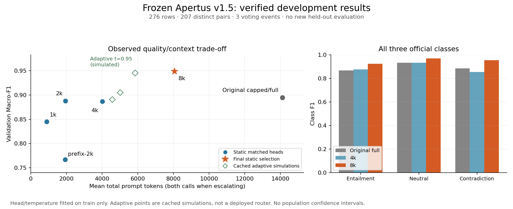
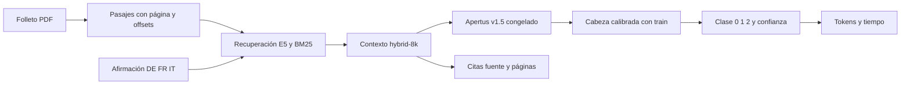

# Phase2: resumen científico de Apertus OST

## 1. Controles de dependencia del documento

| Entrada del sistema original | Macro-F1 de validación |
|---|---:|
| Folleto correcto |0.894461|
| Solo afirmación, cabeza entrenada exclusivamente en train |0.699640|
| Folleto de otro evento, mismo idioma; seed42 |0.565341|
| Folleto de otro evento, mismo idioma; seed1337 |0.553328|
| Premisa vacía, cabeza original congelada |0.210229|
| Premisa genérica, cabeza original congelada |0.174688|

La caída con folletos incorrectos respalda dependencia del contexto. El buen resultado sin documento muestra señales de clase en las afirmaciones; estos controles no demuestran grounding semántico universal. Las etiquetas originales miden retención bajo intervenciones, no la verdad NLI de las nuevas parejas.

Controles de la cabeza/contexto final: wrong-42=0.468262, wrong-1337=0.453133, empty=0.273247. Todos los controles registrados exigidos para la selección pasan.

## 2. Contexto y frontera observada

| Contexto/cabeza correspondiente | Macro-F1 | Tokens medios | Segundos medidos en caché |
|---|---:|---:|---:|
|hybrid-1k|0.844729|893|0.523|
|hybrid-2k|0.887575|1941|0.777|
|hybrid-4k|0.886942|4017|1.365|
|hybrid-8k|0.949069|8060|2.520|
|prefix-2k|0.766764|1921|0.453|
|Original full, comprobación A6000|0.894461|14106|3.316|

La frontera observada entre configuraciones estáticas de F1/tokens/latencia contiene1k,2k,8k y prefix2k.4k fue la elección de eficiencia registrada bajo restricciones adicionales por clase e idioma; no se presenta como punto global no dominado. La alternativa8k se registró separadamente tras observar una mejora material. La selección de arquitectura usa validación y no es descubrimiento ciego. Las latencias de contextos compactos suman codificación, recuperación y cabeza por separado; no incluyen arranque, extracción PDF ni HTTP.

## 3. Evidencia

Se verificaron texto exacto, página, offsets y SHA del PDF. El solapamiento lexical5gram con referencias para hybrid-8k es un diagnóstico de desarrollo, no la métrica oficial. Referencias nunca son necesarias en producción. Se ejecutaron **12** inferencias reales solo con las1–2 citas propuestas: preservación **75.0%**; **12** contextos fueron estrictamente reducidos, con preservación **75.0%**. Esto mide sensibilidad, no prueba humana de suficiencia ni atribución.

La inspección cualitativa de9 casos por idioma/clase está en evidence-audit.json. Las citas de salida siguen siendo contexto fuente ordenado, no pruebas mínimas certificadas. Neutral requiere cautela: no encontrar evidencia en el contexto seleccionado no prueba ausencia en todo el folleto. La posible ambigüedad de alcance de ost-v1.1-0732 se conserva sin cambiar etiquetas. Las expansiones por vecinos/diversidad usan90 casos fijos y no se adoptan a partir de esa pequeña muestra.

## 4. Arquitectura congelada

**hybrid-8k**, recuperación híbrida E5/BM25, pasajes íntegros con presupuesto de tokens nativo, Apertus v1.5 congelado y cabeza logística multiclase entrenada/calibrada solo con train. Sin LoRA, QLoRA,70B, cuantización ni router adaptativo.

Validación final: F1 **0.949069**; cross-language **0.941796**;207 parejas deduplicadas **0.945610**. CLI con3 PDFs cross-language y petición real de subida/predicción del frontend se verificaron sobre GPU. El Docker frontend requiere el backend nativo configurado; las GPUs desechables se destruyeron tras archivar las pruebas.

## 5. Calibración

ECE10 bins **0.028410** · Brier **0.070524** · NLL **0.139329**. Temperatura elegida con OOF de train; no recalibración en validación.

| Confianza | n | Exactitud | Confianza media |
|---|---:|---:|---:|
|0.00–0.50|3|0.333|0.490|
|0.50–0.70|15|0.467|0.636|
|0.70–0.85|18|0.889|0.793|
|0.85–0.95|30|1.000|0.916|
|0.95–1.00|210|0.990|0.991|

Diagnóstico semántico complementario: presencia del pasaje fuente más próximo a la referencia E5 **78.1%** en casos Entailment/Contradiction. Es una aproximación dependiente del mismo recuperador, no recall de evidencia humana ni evaluación oficial; véase semantic-reference-diagnostic.json.

La simulación4k→8k con umbral0.95 logra F1 **0.945312**, **5853** tokens y **1.949s**, escalando **22.8%** de los ejemplos. Es una alternativa prometedora, no un resultado negativo.8k fijo ofrece mayor F1, mayor presencia de pasajes próximos a referencia y una sola cabeza/forward; el router carece de verificación propia de ejecución completa y de transferencia del umbral a folletos independientes. No se adopta en producción.

Los umbrales adaptativos solo se simularon con caché, contabilizando ambos forwards al escalar. No se adopta complejidad adicional. Las probabilidades de controles con documento incorrecto no se interpretan como calibración de etiquetas NLI verdaderas.

## 6. Cómputo

Gasto Vast total observado: **USD4.9787**. Gasto incremental Phase2: **USD1.5128**. Crédito observado restante: **USD5.0213**. Instancias de esta tarea activas: **0**, destrucción verificada por API paginada. Se conservó la reserva de USD2 y el límite adicional de USD4.50. Contabilidad del proveedor sujeta a cargos tardíos; budget.json y resource-audit.json contienen timestamps, precios, duración y observaciones por etapa.

## 7. Conclusión científica

**La hipótesis recibe apoyo parcial en este benchmark de desarrollo.** Las representaciones de Apertus congelado permiten una cabeza ligera con F10.949, y los controles de folletos incorrectos reducen materialmente la retención. El contexto baja de aproximadamente14106 a8060 tokens sin sacrificar la calidad de validación. Esto justifica la arquitectura final, no una afirmación universal de razonamiento o generalización.

Persisten señales en las afirmaciones, solo3 eventos y2 unidades conectadas de validación, duplicados/paráfrasis, posible ambigüedad de alcance y evidencia no certificada. Se requiere evaluación en nuevos folletos independientes. Los310 ejemplos consumidos nunca se reabrieron en Phase2: su F1 histórico0.899920 pertenece únicamente al sistema original full, no a la nueva cabeza compacta. No se justifica gastar el remanente en LoRA con esta evidencia.

Fuente completa: [technical_report.md](../../technical_report.md); métricas: context-results.json, final-results.json y accuracy-results.json cuando exista; errores: selected-error-analysis.jsonl.

The 4k and 8k minimal-evidence audits use different class/language-stratified cohorts; 3/12 versus 9/12 is descriptive, not a paired causal comparison.
