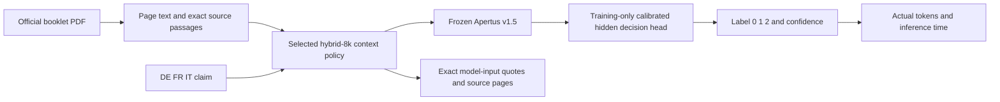

# Apertus Evidence Lab — Track 2A OST technical report

## 1. Summary

Final Phase2 deployment: **hybrid-8k**, development validation Macro-F1 **0.949069**, cross-language **0.941796**, mean prompt tokens **8060**. All Apertus weights frozen; no LoRA. The historical310 score below applies only to the original full-context system. Final grounding/evidence/calibration controls and limits are detailed in the completed Phase2 section.

The adopted challenge contract requires booklet + claim, fixed labels 0 entailment /
1 neutral / 2 contradiction, Apertus v1.5, and transparent source passages. Production
must not require reference strings. The app now implements PDF processing,
multilingual semantic/BM25 fusion retrieval, source provenance, a Docker UI and
single/batch CLI. Exact CLI/evidence schemas are project choices, not blockers.

**Historical Phase1 experiments (original full-context head):** ten validation baselines, two training-only decision heads, and the frozen 310-row internal holdout. On 276 validation rows, the best base configuration reaches Macro-F1 **0.671612**, the option-logit classifier **0.721862**, and the original hidden classifier **0.894461**. That original system reaches **0.899920** on 310 internal holdout examples. These are internal, booklet-disjoint results, not the organizer's hidden score. No matched base-model NLI run on the 310 holdout was made, so the 22.3-point improvement is a validation comparison only.

Apertus weights remain frozen: no LoRA or model-weight fine-tuning. A standardized multinomial logistic-regression head was fitted on 902 training examples. Model files, source predictions, head parameters and all recovered artifacts are SHA-256 verified. Validation/features were encoded on an A40; the final heldout evaluation and three actual multilingual PDF CLI cases ran on an RTX A6000, using BF16 text weights, FP32 tokenizer submodules, no quantization, Torch 2.8.0/CUDA 12.8 and the pinned official fork.

A mistaken controller reboot interrupted the heldout evaluation after 26 persisted predictions. Recovered output preserves those exact bytes and appends only the 284 missing examples with unchanged selection, head and inputs. No partial-test score was used for selection; no training or calibration followed test inference. The resume audit records one logical fixed holdout, not a claim of exactly 310 GPU calls: an interrupted in-flight request may have been retried, and three public CLI integration requests were made separately. Phase1 task credentials were removed; user-managed phase2 provider credentials are preserved. Cached inference needs no token. Earlier Apertus 2509 reference-only results remain historical research.

## 2. Architecture

PDF → per-page text → overlapping source passages (1,200 characters, overlap 200)
→ selected hybrid-8k native-tokenizer context policy (see completed Phase2 study)
→ configured Apertus v1.5 endpoint → strictly parsed numeric relation → evidence
and runtime/token metadata. The original full/capped system and other retrieval modes remain recorded comparisons; final production uses hybrid-8k. Passage text remains an exact substring of extracted
page text, with page/offsets and original PDF SHA-256. Production uses no labels,
reference strings or dataset baseline scores.

The first extraction used PDF layout mode and fragmented words. Five training-only
extraction comparisons motivated plain extraction; mean full-booklet reference
5-gram coverage improved from 0.2834 to 0.8280 on validation. Both measurements are
retained; matching is approximate and not organizer evidence grading. OCR is not
implemented. Full context is explicitly byte-capped/truncation-reported when used. All 276 validation full-context inputs were truncated at the 48,000-byte document-context budget; this baseline is full/capped, not an uncapped complete-booklet experiment.

## 3. Use of Apertus

Required model: `swiss-ai/Apertus-v1.5-8B`, pinned metadata revision
`a411d838600baf0e3635a3daf66fb7c55fc97bb6`, architecture
`Apertus1p5ForConditionalGeneration`, model type `apertus1p5`. It is distinct from
legacy Apertus 2509; old hidden-head parameters cannot be transferred unchanged.
The selected native endpoint runs the frozen hidden classifier (deployment/head-v15.json); the frontend uses an authorized v1.5 endpoint through
LLM_NAME/LLM_BASE_URL/LLM_API_KEY. Model names must identify the required generation;
The native runner uses the official Transformers fork at
`3797303dda74844e3d1f8977ff5518bb91f818b4`. Text attention uses SDPA while
vision/audio submodels use their supported eager implementation. CPU verification
used Torch 2.8.0+cpu and BF16 text weights, with no quantization; see
`experiments/v15-access-v1/real_cpu_preflight.json`. Cached weights need no token.
Phase1 temporary credentials were deleted. User-managed provider credentials are preserved; cached inference needs no token.

Supporting model: `intfloat/multilingual-e5-small`, immutable revision
`614241f622f53c4eeff9890bdc4f31cfecc418b3`, MIT, CPU, original FP32 weights with
source LFS SHA-256 verification. Masked mean pooling + L2 normalization, `query:` /
`passage:` prefixes, 512-token embedding cap, 384 dimensions. It performs retrieval,
never the NLI decision. No substitute central NLI model is used.

## 4. Data

OSTswiss/MNLIoverSwissVotingBooklets, revision
`9ff08597fb79dc68cbb3af9eb1388f34d21223e6`, original JSONL SHA-256
`87ee4afd9c0ee8861106c50f05884481402ca668aecf927df68fc52d915b02fd`.
1,488 examples, DE/FR/IT, all nine document–claim language pairs. All 60 linked
source PDFs downloaded and parsed; no rows missing from 902 train / 276 validation /
310 internal holdout. PDF manifests record original URLs, hashes, pages and byte sizes.
Raw PDFs/data/weights are separately downloaded and ignored by Git.

Partitions group voting dates and connect dates sharing normalized identical claims,
without label-based partition search. Only two connected train components and two
validation components remain; this limits generalization/calibration confidence.
Reference strings are retained exclusively for oracle/alignment diagnostics.
The 310 holdout is internal, not the organizer's hidden evaluation.

## 5. Evaluation

Three-class Macro-F1 and per-class/language/pair/cross-language metrics are implemented;
actual endpoint token usage and time are recorded. Probabilities/calibration are null
when the endpoint supplies only a hard class. No fake posterior or token estimate.

Real retrieval-only validation on 276 full-booklet inputs, k=5:

| Retrieval | Mean reference 5-gram coverage | Cross-language coverage |
|---|---:|---:|
| BM25 | 0.147356 | 0.080880 |
| Multilingual E5 dense | 0.200044 | 0.191805 |
| Hybrid | 0.213526 | 0.187803 |

Hybrid k=5 was frozen from validation before one internal holdout retrieval comparison.
On the 310-row internal holdout, BM25/dense/hybrid mean reference overlap is
0.194468/0.201401/0.253554; cross-language overlap is
0.116697/0.176814/0.203536. The final NLI holdout result is reported separately below.

This diagnostic measures overlap with available references, not semantic evidence
correctness, official evidence score, or NLI Macro-F1. Dense slightly exceeds hybrid
on cross-language overlap; hybrid wins aggregate overlap. NLI superiority is unproven.

| Validation setup | Macro-F1 | Valid outputs | Context tokens | Latency | Evidence |
|---|---:|---:|---:|---:|---|
| bm25-prompt | 0.402027 | 276/276 | 1651.6 | 0.642 s | Retrieved booklet passages |
| bm25-score | 0.436482 | 276/276 | 1654.6 | 0.401 s | Retrieved booklet passages |
| dense-prompt | 0.509928 (valid subset) | 274/276 | 1396.1 | 0.601 s | Retrieved booklet passages |
| dense-score | 0.498261 | 276/276 | 1395.8 | 0.359 s | Retrieved booklet passages |
| full-prompt | 0.552448 | 276/276 | 14103.1 | 3.911 s | Full/capped source context |
| full-score | 0.671612 | 276/276 | 14106.1 | 3.635 s | Full/capped source context |
| hybrid-prompt | 0.496620 | 276/276 | 1653.6 | 0.667 s | Retrieved booklet passages |
| hybrid-score | 0.526883 | 276/276 | 1656.6 | 0.426 s | Retrieved booklet passages |
| reference-prompt | 0.531363 | 276/276 | 2266.7 | 0.779 s | Oracle/reference only |
| reference-score | 0.535419 | 276/276 | 2269.7 | 0.540 s | Oracle/reference only |
| full / option_logits | 0.721862 | 276/276 | 14106.1 | 3.636 s | Full/capped source context |
| full / hidden | 0.894461 | 276/276 | 14106.1 | 3.636 s | Full/capped source context |

Dense generation has two invalid decisions; its score uses 274 valid outputs and the configuration is excluded from selection. All other validation setups have complete outputs. Oracle evidence is a diagnostic, not a strict upper bound: larger context can help. All production modes use booklet + claim only. Full/capped context was truncated for all 276 validation rows at the 48,000-byte document-context budget. Head validation latency is cached A40 encoding plus separately measured CPU classifier time; it is not a live integrated service measurement.

The original Phase1 hidden head uses4096 features. StandardScaler and multinomial logistic regression were fitted within each training-only connected-group fold. The C grid is 0.001, 0.01, 0.1, 1; selected C is 0.01, and training-only OOF temperature is 2.148798. Training has only two connected groups (fold sizes 838, 64), limiting confidence. The predeclared gate was +0.02 validation Macro-F1 over the best booklet-only baseline; observed gain 0.222849 passed. Test labels were excluded from fitting, calibration and selection.

**Frozen internal holdout: 310 examples, Macro-F1 0.899920, accuracy 0.900000, average context 14070.0 tokens, average actual inference plus measured retrieval 3.281 seconds on RTX A6000.** Startup, weight verification/download, PDF extraction and interrupted downtime are excluded from per-example latency. The additional classifier requires no additional Apertus forward pass; its training and lease time are still costs. 310/310 heldout inputs report context truncation.

| Official class | Holdout F1 | Support |
|---|---:|---:|
| 0 Entailment | 0.870000 | 92 |
| 1 Neutral | 0.956522 | 104 |
| 2 Contradiction | 0.873239 | 114 |

| Claim language | Validation Macro-F1 | Holdout Macro-F1 | Holdout n |
|---|---:|---:|---:|
| DE | 0.878468 | 0.881537 | 109 |
| FR | 0.886981 | 0.889234 | 86 |
| IT | 0.911735 | 0.922059 | 115 |

Cross-language holdout: 205 examples, Macro-F1 0.889426.

| Document → claim | Validation Macro-F1 | Holdout Macro-F1 | Holdout n |
|---|---:|---:|---:|
| DE → DE | 0.915344 | 0.843640 | 26 |
| FR → DE | 0.835940 | 0.885931 | 53 |
| IT → DE | 0.911111 | 0.859025 | 30 |
| DE → FR | 0.710317 | 0.866667 | 23 |
| FR → FR | 0.908751 | 0.851010 | 34 |
| IT → FR | 0.973374 | 0.958170 | 29 |
| DE → IT | 0.790065 | 0.911111 | 35 |
| FR → IT | 0.938841 | 0.845192 | 35 |
| IT → IT | 1.000000 | 1.000000 | 45 |

Holdout calibration: ECE 0.083631, Brier 0.168119, NLL 0.315898; temperature was fixed using train-only OOF scores. Evidence-ID metrics contain no annotated full-booklet gold spans and must not be treated as evidence-quality scores. Actual PDF CLI evidence quotes/pages were checked for provenance; minimality, relevance and causal model attribution are not established.

Legacy timings are offline GPU encoding plus separately timed CPU head, not live CPU
or integrated service latency. Legacy exact-deduplicated score is 0.965299 on 207 rows.
Training head/calibration used train only. These old results must not be renamed
v1.5 or full-booklet scores. Historical details/negative results are preserved in
`docs/legacy_apertus_2509_report.md` and experiment directories.

## 6. Limitations

The 310 examples are an internal heldout split, not organizer-hidden evaluation. Only two connected groups in train and validation, duplicate/translated examples and small language slices limit generalization claims; no confidence interval based on independent documents is asserted. No matched base-model holdout run was made. Full context is capped at 48,000 document bytes, so later evidence can be omitted. Retrieved/supplied passages are source-grounded candidates, not validated minimal proof or model attribution. Semantic evidence quality has not been manually scored; reference overlap is approximate. No OCR, LoRA, weight fine-tuning, or official hidden evaluation was performed. Native v1.5 needs the pinned fork and considerable RAM/VRAM; CPU operation is slow. The default Docker frontend requires a separately configured compatible backend. No unspecified organizer interface, hardware or network restrictions are invented.

## 7. Reproducibility

Clean-checkout `make run` builds the lightweight PDF/HTTP Dockerfile, installs
hash-locked dependencies and starts port 8000. The lightweight frontend itself requires no model download; the selected native hybrid backend requires E5. Optional `RUNTIME=hybrid` supports frontend retrieval experiments. Classification needs
an authorized v1.5 endpoint; unavailable inference produces an explicit failure.
Project-defined CLI: `python -m ost_nli predict BOOKLET.pdf CLAIM`; its default
context comes from `deployment/v15-selection.json`. Explicit overrides are documented.
Batch JSONL contains id/document/claim only. Source passages carry pages/offsets/hash.
Documented interface is separable from model/retrieval implementation.

The recorded host and freshly rebuilt Docker image pass 38 tests each; the restored current host also passes 38 tests and make run processed a real 40-page PDF with verified source quotes/pages (experiments/v15-restored-frontend-v1); `experiments/v15-production-context-v1` verifies full/capped source handling on a real French PDF and includes an HTTP regression that sends the same full context through CLI and web. The earlier 37-test image is recorded separately;
`experiments/v15-fresh-docker-v1` records a real PDF upload and hybrid evidence
retrieval through `make run` without mounting host source into the image. The
following earlier clean-checkout check ran 36 tests. A clean GitHub checkout successfully
ran `make run`, downloaded fresh public E5 weights, and retrieved source passages
from an official French PDF for German, French and Italian claims. Source hashes,
pages and quote offsets were checked. Unconfigured v1.5 prediction correctly fails
without returning a label. Records are in `experiments/contract-software-v1/`;
the separate synthetic HTTP batch fixture does not constitute real v1.5 inference.
The final deployment image also passed all 38 tests with no failures/skips; /benchmarks serves the exact final JSON and the packaged head SHA matches the frozen source (experiments/v15-final-frontend-v1). Its current frontend has no persistent NLI backend configured; actual selected v1.5 NLI was verified by the three real GPU PDF CLI cases. CPU PDF/retrieval checks are separate from GPU benchmark performance.
Lease costs, failures, active IDs, cleanup deadlines and verified destruction are
recorded in `experiments/budget.json`. Provisioning failures produce no NLI score.
The USD 10 hard budget and USD 2 reserve remain binding; billing is asynchronous.

At Phase1 closure, all21 then-recorded task leases were destroyed and verified absent from the paginated provider listing. Observed account-credit reduction is USD 3.465574; observed credit remaining is USD 6.534426, checked at 2026-10-07T20:45:40.024679+00:00. No outstanding task lease remains. Billing may settle asynchronously. The temporary task SSH key was removed and unrelated keys preserved; Phase1 task HF secrets were absent from Vast at that check. Phase2 user-managed credentials are preserved. The new cloud HF_TOKEN binding was retained and its gated configuration access verified without downloading weights. See experiments/v15-final-provider-cleanup.json and budget.json.


Reproduce the selected backend with verified weights and the pinned native dependencies:

```bash
PYTHONPATH=track_2a/src python track_2a/scripts/serve_v15.py \
  --model-dir /path/to/verified/apertus-v15-model --device cuda \
  --method head --head track_2a/deployment/head-v15.json --retriever-dir /path/to/verified/e5 --port 8001
```

On Python 3.11/Linux install requirements-v15-cuda.lock, requirements-v15.lock, then requirements-head-v15.lock to match the native head runtime; run scripts/check_v15_cuda.py. The frontend needs LLM_NAME=swiss-ai/Apertus-v1.5-8B and a reachable LLM_BASE_URL ending /v1 for this head-enabled service; ordinary base-model chat endpoints do not reproduce the reported classifier. The server above listens on loopback. On Linux a Docker frontend can use --network host and LLM_BASE_URL=http://127.0.0.1:8001/v1; configure NO_PROXY for local requests. Model weights and adapters are not downloaded into the repository. Download authorized weights once through ost_nli.v15.download(directory, os.environ["HF_TOKEN"]) in the native environment; it pins the revision and checks every original shard hash. Then use the offline cache. Generic .venv does not establish native-fork readiness.

Scientific raw artifacts: experiments/apertus-v15-research-v1 (validation, training, both heads, final selection/predictions/metrics, model/input manifests, resume audit and actual CLI output). Large binary features remain ignored; model/data downloads are reproducible separately. The original inference/frozen-selection commit is 15c6e57b4992a513ffa5f5eec350282e11dd63d5. Resume/PDF-path orchestration was committed as 9910fe36ad1a90bbd182737a2a4ff8579aaf42c6, copied into that checkout, and separately SHA verified. The engine and frozen head/inputs were unchanged; the dirty runtime tree is explicitly recorded. Archive SHA, every source file SHA, split fingerprints, initial 26 predictions and deployed head SHA were verified locally; Macro-F1 was independently recomputed from the confusion matrix (experiments/v15-delivery-integrity.json).

## 8. Next steps

Research and the internal frozen holdout are complete. Further work should use new development documents for improving evidence relevance and context compression; do not tune against the 310 holdout. Confirm any subsequently published evaluator adapter and arrange a documented v1.5 backend for judging. Actual submission through the organizer site is a separate action.

## 9. License

Code Apache-2.0; report CC-BY-4.0 following the template. OST dataset metadata MIT;
multilingual E5 MIT; Apertus v1.5 Apache-2.0 with published access/AUP conditions;
pypdf BSD-3-Clause. Original booklet content remains attributed to the Federal Chancellery.

## 10. References

- Adopted user-provided OST contract: `docs/challenge_contract.md`.
- https://github.com/HackApertus/project-template/tree/main/track_2a
- https://huggingface.co/datasets/OSTswiss/MNLIoverSwissVotingBooklets
- https://www.bk.admin.ch/de/sammlung-der-abstimmungsbuechlein-seit-1978
- https://huggingface.co/swiss-ai/Apertus-v1.5-8B
- https://huggingface.co/intfloat/multilingual-e5-small
- Submission: http://hackapertus.ch/online-hack/submissions

## Phase 2 — completed falsification and efficiency study


All Apertus weights remain frozen. No LoRA, QLoRA,70B or model-weight fine-tuning. The consumed310 predictions were not reopened, re-inferred, recalibrated or used for selection. The new architecture comparisons use902 training/276 validation examples only. Training-only connected-group OOF selects head regularization and temperature. Architecture selection is validation development, not new independent held-out proof.

### Actual grounding controls

| Condition | Original-label validation Macro-F1 |
|---|---:|
| Correct capped/full original head | 0.894461 |
| Claim-only separately training-fitted head | 0.699640 |
| Empty premise, frozen original head | 0.210229 |
| Wrong-event same-language booklet, seed42 | 0.565341 |
| Wrong-event same-language booklet, seed1337 | 0.553328 |
| Generic premise, frozen original head | 0.174688 |

The preregistered gate passes with limitations: substantial context-intervention drops support document dependence. Claim-only .700 and lexical/metadata controls expose residual claim-label signal. Wrong/empty scores use original labels as retention targets; these are NOT true NLI labels for intervened premises. Generic/empty predict Neutral almost exclusively; low original-label scores alone do not prove semantic grounding. Two permutations and few independent events limit conclusions.

### Context-matched comparisons

| Context | Matched hidden-head F1 | Native restricted base-score F1 | Mean prompt tokens | Cached seconds | Cross-language F1 | Reference5gram coverage |
|---|---:|---:|---:|---:|---:|---:|
| hybrid-1k | 0.844729 | 0.499006 | 892.8 | 0.523 | 0.795535 | 0.141 |
| hybrid-2k | 0.887575 | 0.526673 | 1941.0 | 0.777 | 0.842796 | 0.239 |
| hybrid-4k | 0.886942 | 0.573981 | 4017.4 | 1.365 | 0.853584 | 0.352 |
| hybrid-8k | 0.949069 | 0.548775 | 8059.6 | 2.520 | 0.941796 | 0.495 |
| prefix-2k | 0.766764 | 0.347449 | 1920.9 | 0.453 | 0.785921 | 0.122 |
| Fresh original full A6000 recheck | 0.894461 | 0.671612 | 14106.1 | 3.316 | 0.873829 | historical0.586 |

Hybrid depth5/10/20/30 and total prompt caps1024/2048/4096/8192 are jointly varied, not a factorial causal experiment. Prefix2048 is document-order control. Whole source passages are packed with the official tokenizer including system/claim/assistant prefix. No reference enters inference. Matched-head seconds sum separately measured encoding, retrieval and CPU decision overhead; they are not full HTTP/PDF request latency. The fresh full recheck measures actual integrated prediction on the same GPU family. Initialization and PDF parsing are separate.

Historical unchanged-full-head context diagnostics: full .894461/14106tokens/3.635s; BM25 .661108/1655/.401; dense .848070/1396/.359; hybrid .861704/1657/.426; oracle/reference .940951/2270/.540. The oracle is a perfect-reference evidence diagnostic for the original frozen full head, unavailable in production; it is not a universal mathematical ceiling for different matched heads. Applying a full-trained head to retrieval features diagnoses distribution shift and is distinct from matched-head training.

### Frozen decision and live verification

Final choice: **hybrid-8k**, validation Macro-F1 **0.949069**, cross-language **0.941796**, deduplicated207-pair Macro-F1 **0.945610**. Originally registered efficiency choice: hybrid-4k; final verification candidate: hybrid-8k; final guard failures: []. Choose smallest mean token count only among candidates within .02 overall/.03 cross-language/.05 each-class F1 of original full; also check against fresh full replication. This original efficiency decision is immutable. A separately registered exploratory8k accuracy extension can supersede deployment only with >=.04 overall and>=.03 cross-language F1 gains, no class regression, <=75% original full tokens, no worse Brier/NLL, matched grounding guards and actual CLI/frontend replication. Both use the same development validation; neither establishes independent hidden-test superiority.

| Final provisional-head intervention | Original-label F1 | Retention |
|---|---:|---:|
| wrong-42 | 0.468262 | 0.493 |
| wrong-1337 | 0.453133 | 0.477 |
| empty | 0.273247 | 0.288 |

Original-full A6000 recheck changed 0 of276 labels from historical A40; maximum probability difference 0. Same weights, head and input contract. This explicitly checks the hardware/numerical confound in initial grounding comparisons.

Three actual native GPU PDF CLI calls cover DEclaim/FRdocument, FRclaim/ITdocument and ITclaim/DEdocument. An additional actual frontend PDF-upload/prediction request uses the same frozen head. Source PDF hashes, labels, exact quotes/pages, token counts and measured request times are archived. Browser visual rendering is a separate check; API inference is real. See final-results.json, accuracy-results.json if available, and their source experiments. The accuracy extension reuses the verified276 full recheck and180 unchanged4k neighbor/diversity forwards; it does not repeat them.

### Evidence, errors, calibration and uncertainty

Every packed source quote/page/offset/hash is checked against the canonical PDF extraction. Evidence output is explicitly model-input source context, not validated minimal proof or attribution. Reference5gram overlap is an approximate development diagnostic, not organizer scoring. Neutral references may be intentionally unrelated; their absence is not an evidence-retrieval failure. Booklet-wide Neutral remains difficult to establish with retrieved context. The possible reference-vs-booklet scope conflict ost-v1.1-0732 remains documented without relabeling. The deterministic nine-case source inspection is reported separately in evidence-audit.json; it is qualitative, not blinded official evidence scoring.

Final calibration: ten-bin ECE **0.028410**, Brier **0.070524**, NLL **0.139329**. Confidence buckets, class/language/pair/event metrics and all remaining validation errors with qualified source hypotheses are in final-results.json. No validation temperature fitting. Cached routing simulations at fixed confidence thresholds .50/.70/.85/.95 count both forwards when escalating; no threshold/router is adopted.

Original full head fixes82 base mistakes but introduces20 errors where the restricted base score was correct; both err on9. Both source-inspected75%/three-quarters cases already have correct base decisions with identical input. This is decision-mapping evidence, not proof that Apertus weights cannot handle numeric equivalence or that LoRA would help.

Validation has276 rows but207 unique claim/document pairs, three voting events and two duplicate-connected units199/77; train also has only two connected units838/64. Exact normalized train/validation claim overlap is zero, but E5 claim1-nearest-neighbor scores .584 and high-cosine near-paraphrases occur across events. Descriptive event/component resampling is not a defensible independent-document population confidence interval. Language slices and validation model selection are not organizer-hidden generalization claims. Historical310 F1 .899920 belongs only to the original full head; any newly selected compact head has no fresh held-out score.

### Costs, reproducibility and remaining work

Phase2 observed incremental provider spend **USD1.5128**, remaining credit **USD5.0213** at 2026-10-08T02:14:17.173797+00:00. Task-owned active leases: **0**. Authorized cap USD4.50; required reserve USD2. Provider accounting can post delayed charges. Full lease/deletion/pagination verification is in experiments/budget.json; bound estimates are not final invoices.

Clean-checkout make run builds the hash-locked Docker PDF/HTTP application. Configure the documented pinned native head backend via LLM_NAME/LLM_BASE_URL/LLM_API_KEY (or explicit FROZEN_BASE_URL). A generic base chat endpoint does not reproduce a learned hidden head. The native backend uses the pinned PyTorch image, CUDA12.8/hash-locked requirements, official Apertus fork and original six SHA-verified model shards; supporting E5 is required only for hybrid context. Cache downloads outside Git; cached inference requires no model-download token. Original head, source predictions, model/dataset/PDF manifests, input contracts, registered protocols, actual feature archives and source-file SHA checks preserve auditability.

No scientific evidence here justifies spending the remaining credit on LoRA now. Priorities are new independent booklet evaluation, semantic evidence sufficiency and resolving premise-scope ambiguity with organizers. Exact future evaluator adapters can be added without changing document/claim inference. No invented hardware/Internet/CLI restrictions and no Devpost dependency. Submission to the organizer website is a separate action.

### Frozen architecture



### Bounded neighboring/diversity ablations and evidence-only forwards

Both ablations use the same deterministic90 validation rows (first10 per gold-class/claim-language stratum), frozen hybrid4k matched head and4096 total-token cap. No new head training and no small-sample architecture adoption.

| Same90 cases | Macro-F1 | Mean tokens | Seconds | Neutral precision | Neutral recall |
|---|---:|---:|---:|---:|---:|
| Direct top20 | 0.878545 | 4010.0 | 1.712 | 0.964 | 0.900 |
| Top6 seeds with source neighbors | 0.912086 | 3866.2 | 0.995 | 1.000 | 0.900 |
| Duplicate-suppressed top30→20 | 0.889580 | 4022.5 | 1.087 | 0.964 | 0.900 |

Neighbor/diversity request adds shared measured retrieval/preparation plus actual encoding/head; baseline is cached. Not paired live all-inference latency.
Diversity suppresses same-page50% overlap or word5gram Jaccard>=.55. Neighbor expansion takes seed/previous/next source passages. Both preserve exact numbers/text; neither adds a summarizing LLM. Redundancy counts and source IDs are archived. Any gain on90 cases is a follow-up hypothesis, not a new deployment choice.

Proposed semantic/hybrid-ranked **one/two-passage evidence**: **12 actual native evidence-only forwards**, decision preservation **0.750**. Strictly reduced contexts: **12**, preservation **0.750**. Cases are first2 distinct normalized claim/document pairs predicted Entailment/Contradiction per claim language; no confidence cherry-picking. The same frozen candidate head receives only those proposed source quotes. Strictly reduced cases are reported separately; unchanged one-passage contexts do not establish evidence sufficiency. Preserved decisions do not prove relevance or sufficiency, and changed predictions do not automatically invalidate evidence. No minimal-proof claim or automatic evidence-based router is adopted. Exact quote/page proofs and actual feature SHA checks are retained.

### Additional fixed-grid4k to8k adaptive simulation

Threshold0.95 escalates **22.8%** of276 rows and simulates Macro-F1 **0.945312**, **5853** tokens and **1.949s**, counting both forwards. This is a promising lower-token point, not a failed or dominated idea. Its E/C reference-nearest quote presence is **66.3%**, versus78.1% for fixed8k. Fixed8k is retained for higher static F1/source coverage, one head/one forward and verified live integration; no independently verified router is claimed. Threshold transfer and actual live routing costs need new independent booklets. All four fixed thresholds and class/language/calibration metrics are in adaptive-8k-simulation.json. No additional GPU inference or310 access.

### Supplementary semantic-reference alignment

On178 Entailment/Contradiction validation rows, hybrid-8k includes the E5 reference-nearest source passage in **78.1%** of inputs and **71.3%** of the reference-nearest3 passages. This ranks all same-booklet passages with the development reference as query, not the claim. These nearest passages are pseudo-targets, not human gold evidence. The same E5 encoder supports retrieval, so this is a dependent diagnostic;512-token truncation applies. Neutral is reported separately descriptively. No reference enters production inference. Full details and source SHA checks: semantic-reference-diagnostic.json.

The 4k and 8k minimal-evidence audits use different class/language-stratified cohorts; 3/12 versus 9/12 is descriptive, not a paired causal comparison.

Final frozen deployment packaging verification: clean tracked-tree commit 5a333f1a61e684b986f778068a5babe0664154af built and started via `make run`; 41 host core tests, 41 clean Docker core tests and 2 NumPy research tests passed. An actual 72-page source PDF retained exact page/offset/SHA provenance. Packaged 8k head SHA matched; the only host bind is the read-only cloud TLS certificate, with no source mounts. Current CPU frontend has no persistent native backend after rental cleanup and rejects unconfigured classification. Actual Apertus PDF CLI/frontend inference is separately archived in GPU integration proofs; UI fields checked, browser appearance not tested. See Phase2 `software-validation.json` and `final-frontend-verification.json`.
